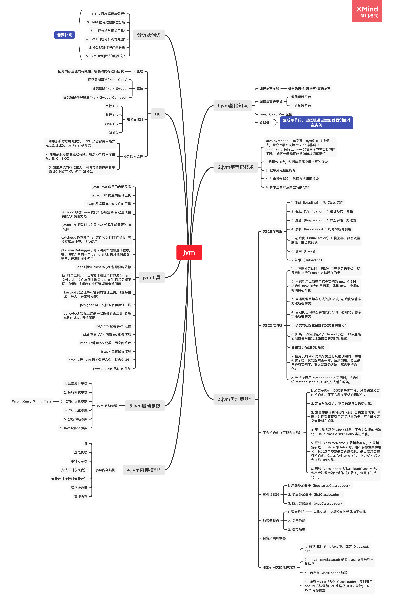
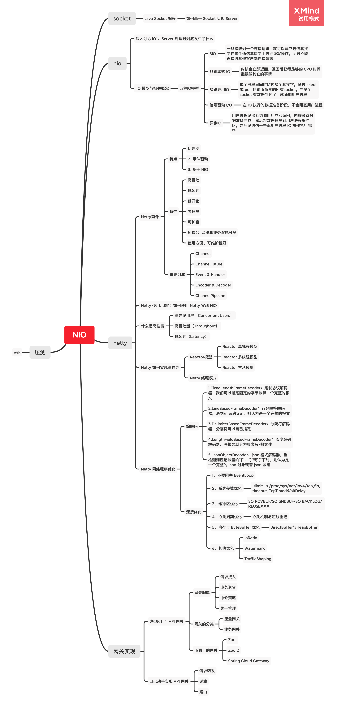
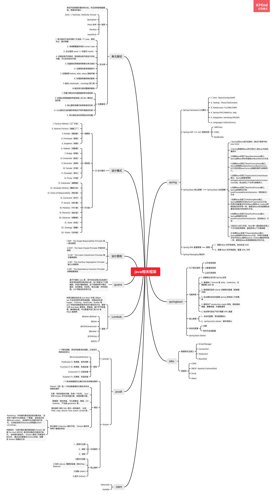
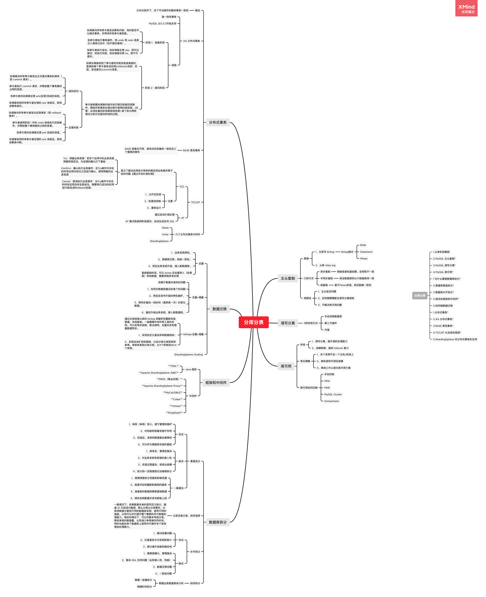
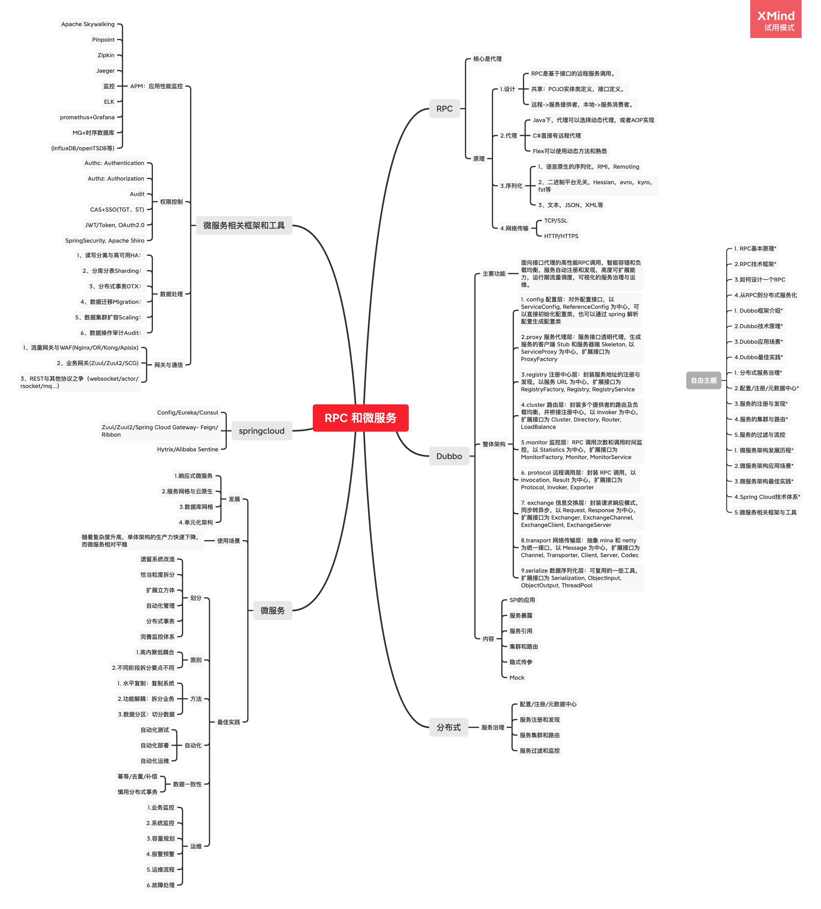
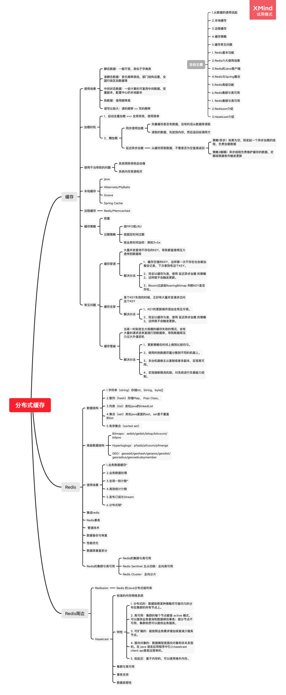
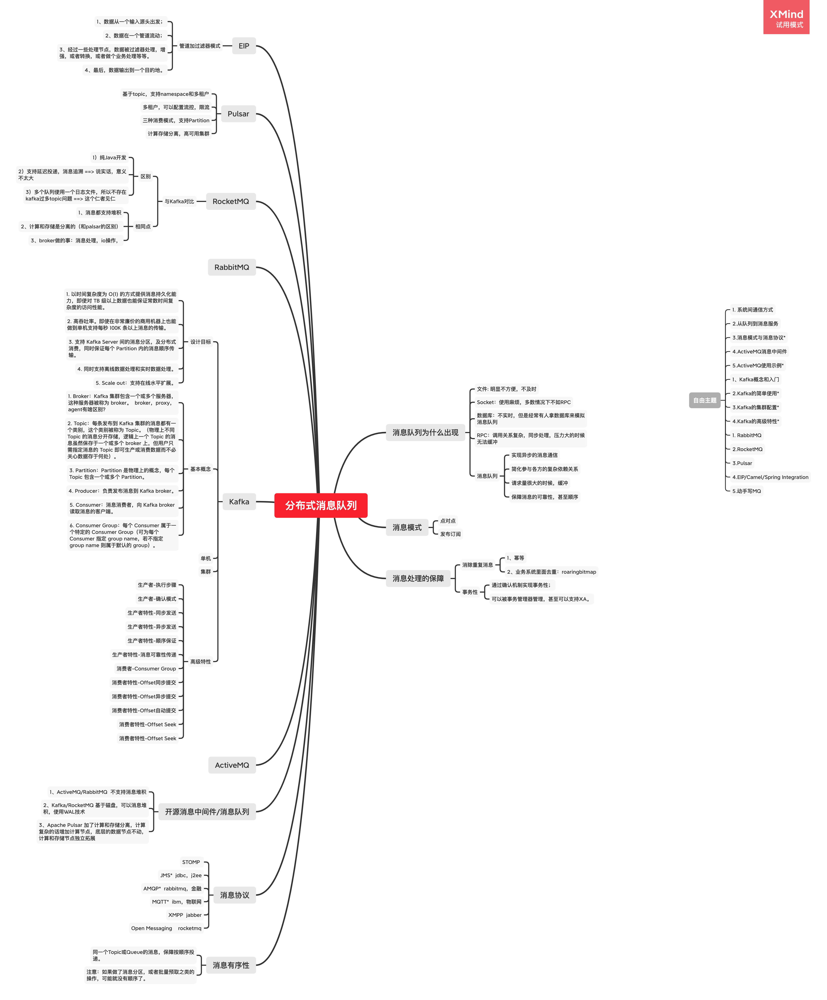

# java训练营大作业

**1、(必做)**分别用 100 个字以上的一段话，加上一幅图 (架构图或脑图)，总结自己
对下列技术的关键点思考和经验认识:
1)JVM
2)NIO
3) 并发编程
4)Spring 和 ORM 等框架
5)MySQL 数据库和 SQL
6) 分库分表
7)RPC 和微服务
8) 分布式缓存
9) 分布式消息队列

**要求提交毕业项目 + 毕业总结**，毕业总结写在 README 文件里即可。
以上作业，要求 1 道必做题目提交到 GitHub 上面，毕业项目作业提交地址：
https://github.com/JAVA-000/JAVA-000/issues/149
毕业项目提交截止时间 2 月 3 日（周三）23:59 前。

1)JVM

经过jvm这一章的学习，对java运行的情况会有一个更深层次的理解。类加载器机制让我们在编码的的时候更加清晰，知道加载类的时候jvm是如何进行处理的。java内存模型让我们知道了程序运行的时候，常量池，方法区，堆，栈，程序计数器，本地方法栈分别是起到一个什么作用，以及程序执行的时候是如何在他们直接进行数据流转的。这些是基础，也是我们启动java程序的时候，如何设置启动参数的参考条件，jvm工具帮助我们了解当前虚拟机的运行情况，根据运行情况的分析我们可以使用jvm的启动参数对jvm进行调优（主旨是减少ygc，变fullgc）。gc算法以及gc方式的了解可以让我们在不同的jvm运行情况下对使用哪种gc进行选择。

2)NIO

NIO（Non-Blocking IO/New IO）给java通信带来了很大的性能提升，是多路复用的基础。它的出现，解决了传统IO阻塞的问题，给海量的连接处理提供了一个解决方案。程序件互相调用的本质就是建立连接，发送消息，处理消息，学习了NIO，可以对如何使用Netty建立长连接处理消息能有更深刻的理解，在这个基础上我们可以基于Netty实现各种中间件，例如Rpc调用，网关，各类中间件之间的通讯等。也可以有针对性地提供优化。

3) 并发编程

并发编程就像一把双刃剑，一方面可以充分利用cpu让程序更快速地执行，另一方面，也给编程增加了难度。并发的实现是基于操作系统层面的，使用了多线程。线程能够创建更加松耦合的设计，使得系统资源更充分利用。但是也有风险，安全性问题【多个线程共享数据时可能会产生于期望不相符的结果】，死锁问题，性能问题【1、线程过多时会使得CPU频繁切换，花在调度上时间太多 2、多线程环境必须使用同步机制，导致很多编译器想做的优化被抑制  3、线程过多还会消耗过多内存】。这些都需要花时间去弄清楚底层原理，才能水到渠成。

4)Spring 和 ORM 等框架

5)MySQL 数据库和 SQL

数据库在大学的时候就有了这门课，专门学习数据库的设计。但是却不了解的其中的实现机制。在查询缓慢的时候，也知道去加索引优化，却没想到在开发的时候就需要想好需要对哪几个字段进行创建索引，都是在查询缓慢的时候才会去做。平时日常中对隔离级别的使用也寥寥无几，要求几乎都是“满足业务要求的查询”即可。目前做的思维导图还不够完善，知识点不去想不去用就是没掌握，等于白学。

6) 分库分表

数据库查询时间变多，锁定的数据变多等，先使用读写分离。当读写分离解决不了的时候。当数据库服务不可用，数据变多并别大批量的访问的时候，这个时候就需要根据业务数据的属性进行分库/分表。分库分表对数据业务属性要求比较高，需要针对业务做不同的划分。且数据迁移是分库分表中最重要的一环，需要考虑业务的容忍度，进行全量，全量+增量，binlog+全量+增量三种方式，可以使用ShardingSphere-Scaling 进行数据迁移。分布式事务的话能不用尽量不使用，会增加业务的复杂度和问题查找的难度。

 7)RPC 和微服务

RPC的诞生是为了像调用本地方法一样调用远程的服务，解决了分布式服务之间调用的问题。服务部署到不同的机器相互调用则避免不了网络通信，如果每次调用都要写一大坨网络通信代码，这显然是不好的。它的诞生，促进了微服务的发展。而随着系统的越来越庞大，如果是单体的，每次修改都要重启一整个大项目，但是就修改了某个模块的一部分代码，如果使用微服务，那么只要启动某个模块的项目即可。又如果某个项目压力过大，可以多部署一些这个服务。种种的好处让我们发展微服务，并开发了一系列周边产品。

8) 分布式缓存

分布式缓存是分布式系统中的重要组件，主要解决高并发，大数据场景下，热点数据访问的性能问题。提供高性能的数据快速访问。如果缓存使用得当，则很大一部分会达到数据库的流量都会被拦截下来，大大减轻数据库的压力。并且redis提供了多种数据结构，足以我们的业务需求。数据容量和数据过期是在缓存时候我们首先要考虑的问题，其次是缓存的命中率，以及如何设置落盘。

9) 分布式消息队列

消息队列有很多好处，解耦，削峰，异步处理，提升系统使用率等。而在分布式系统中，可能有很多服务不需要及时反馈结果，只需要保证任务能够投递成功，投递不成功可以进行重试，消费不成功还可以捞出来重新消费。这次上课还知道了各类mq的区别和优缺点，以及Pulsar这类第三代的mq。

总结：

目前之前的作业还没做完，打算3个月的时间内能够把所有的作业做完，知识点再继续整理一遍。技术这个行业目前涌入的人才越来越多，不学习就会被淘汰，不动手就学不会。学到的东西及时记录，及时编写代码去实践，工作上面目前有很多东西可以用得上，这点是优势。知行合一是很难的，知道要去做但是很多时候身体不停使唤。参加了这次学习，有了很多学习的榜样，尽量向你们靠齐！

最后，感谢秦老师，猫大人，铁锚，崔崔，这个训练营很值。

